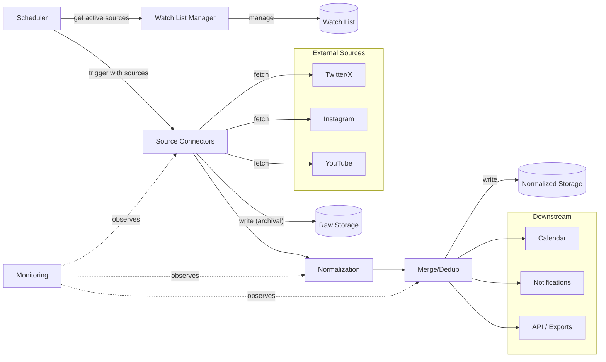

# Oshikatsu Architecture

## Overview

Oshikatsu is a platform for tracking updates about favorite artists and converting them into a unified, analyzable data format. The system ingests data from multiple sources, normalizes it into a consistent schema, deduplicates events, and exports to downstream pipelines.

> **Note:** The platform is built using TypeScript and Node.js. See [TECH_STACK.md](./TECH_STACK.md) for full details on the technology choices.



## Core Components

### 1. Source Connectors

Ingest raw items from external sources (e.g., Twitter/X, Instagram, YouTube).

- Each source has its own connector implementation
- Connectors expose `fetchUpdates()` to retrieve new items
- Connectors are source-agnostic and can be extended independently

### 2. Watch List Manager

Manages the registry of artists and their monitored sources.

- Provides CRUD operations for artists and source entries
- Supports enable/disable toggles per artist and per individual source entry
- Decouples "what to watch" from "how to fetch"

### 3. Normalization Engine

Converts raw source items into the unified internal event schema using LLM-based parsing.

- Receives raw items directly from source connectors (not from storage)
- Exposes `normalize(raw)` to transform raw data into unified format
- Uses LLM to parse unstructured text and extract structured event fields
- Each source may have its own prompt/parsing strategy
- Output follows the unified event schema

### 4. Merge/Deduplication Layer

Identifies and merges duplicate or overlapping events across sources.

- Goal: consolidate multiple source items referring to the same event into a single normalized record while preserving all provenance in `source_entries`
- **Execution**: Runs synchronously as the final step of the ingestion pipeline.
- **Deduplication Strategy**: Queries the Normalized Database for candidates within a specific time constraint (e.g., +/- 48 hours of `event_time` for the same `artist_id`), then employs heuristic matching (semantic `title` similarity or exact link matching) to identify overlaps.

### 5. Downstream Integration

Exposes standardized records to automation workflows.

- Exposes `export(record)` to push data to downstream pipelines
- Supports calendar updates, notification dispatch, and other integrations

### 6. Scheduler

Runs ingestion cycles periodically and manages execution state.

- Configurable interval (e.g., every 15 minutes)
- Reads active sources from the Watch List Manager and dispatches them to the appropriate connectors
- Idempotent: re-running does not create duplicates
- Graceful shutdown support
- Tracks execution state (last run, next run, errors, and pagination cursors)
- Implements rate limiting and exponential backoff to handle platform API limits.

### 7. Monitoring

Detects failures, tracks health metrics, and sends alerts.

- **Parser failure detection**: detects when selectors break or DOM changes cause fetch failures
- **Health checks**: validates output quality (items fetched, required fields present)
- **Alert thresholds**: zero items fetched, high error rate, stale data
- **Selector health tracking**: tracks selector match counts over time for trend analysis
- **Automated detection**: detects anti-bot pages, login prompts, CAPTCHAs
- **Health check command**: `healthcheck` command for external monitoring
- **Alert delivery**: email, webhook, or log-based alerts

### 8. Storage

Handles persistence of data across the pipeline.

- **Watch List**: Persists the artist registry and source entries with their enabled/disabled states.
- **Raw Storage**: Persists raw payloads fetched from sources before normalization, along with metadata (source identifier, fetch timestamps, processing status).
- **Artist Database**: Reference database of artist profiles and their known sources (e.g., social media accounts, channels). Used for enrichment and linking normalized events to known artists.
- **Venue Database**: Reference database of venue information, used for enrichment and deduplication of event locations.
- **Normalized Storage**: Persists unified event records after deduplication, and provides query capabilities for downstream consumers.

## Data Model

### Unified Event Schema

```json
{
  "id": "internal record identifier",
  "source_entries": [
    {
      "source_id": "original ID from the source",
      "source_name": "source identifier (e.g., 'twitter')",
      "publish_time": "when the source item was published",
      "url": "link to the original source item",
      "author": "who posted it (user ID, username)",
      "raw_content": "original text/content",
      "fetch_time": "when the item was ingested"
    }
  ],
  "title": "canonical event title or announcement summary",
  "description": "normalized content summary",
  "event_time": "actual event or activity time",
  "start_time": "event start time",
  "end_time": "event end time",
  "venue": {
    "name": "venue name (e.g., 'Tokyo Dome', 'Twitch')",
    "address": "physical address (for in-person events)",
    "coordinates": "latitude/longitude (optional)",
    "url": "platform/stream URL (for virtual events)",
    "city": "geographic context",
    "country": "geographic context"
  },
  "type": "event category",
  "is_cancelled": "boolean flag for cancelled events",
  "artist": {
    "id": "unique artist identifier",
    "name": "display name",
    "handle": "social media handle (e.g., Twitter/X username)",
    "profile_url": "link to artist profile",
    "categories": "artist type (e.g., singer, Vtuber, idol, voice actor)",
    "groups": "associated groups or units (if applicable)"
  },
  "tags": "normalized labels for event type, platform, fandom, or priority"
}
```

### Event Categories

- `announcement` — general announcement
- `live_stream` — live stream event
- `merchandise` — merchandise release/news
- `release` — song/album/content release
- `concert` — concert or live show
- `broadcast` — TV/radio program update
- `collaboration` — partnership or co-branded project
- `side_event` — ancillary activity (merch booth, pre-show session, etc.)

### Event Hierarchy

- **Main events**: May have `sub_events` array
- **Sub-events**: Must have `parent_event_id`, cannot have their own `sub_events`
- Main events represent the core activity (e.g., the concert)
- Sub-events are related activity records linked back to the main event

## Interfaces

All components expose stable, abstract interfaces:

- `fetchUpdates()` — retrieve new items from a source
- `normalize(raw)` — convert raw source items to unified format
- `merge(existing, normalized)` — identify and merge duplicates
- `save(record)` — persist normalized records
- `export(record)` — expose records to downstream pipelines

## User Interface

The platform provides both a **TUI (Terminal UI)** and a **Web UI** for management and monitoring.

### Watch List Management

- Add, edit, remove artists and their source entries
- Toggle monitoring per artist or per individual source
- View active vs. disabled sources at a glance

### Artist & Venue Management

- Browse and edit the Artist Database (profiles, known sources, categories, groups)
- Browse and edit the Venue Database (names, addresses, coordinates)
- Link new sources to existing artists

### Event Dashboard

- View normalized events in a timeline or list view
- Filter by artist, event type, date range, or source
- Drill down into event details including source provenance

### Calendar View

- Visualize events on a calendar (monthly/weekly/daily)
- Color-coded by event type or artist
- Export to external calendar formats (iCal, Google Calendar)

### Ingestion Monitor

- View recent fetch cycles and their status (success, errors, items fetched)
- Inspect raw items and their processing status
- Surface alerts (anti-bot detection, selector failures, stale data)

## Design Principles

- **Modularity**: Clean separation between ingestion, normalization, deduplication, storage, and downstream export
- **Source-agnostic**: Design allows adding new sources with minimal impact
- **Provenance preservation**: Preserve source provenance while normalizing records
- **Incremental growth**: Start with a single source (Twitter/X) and expand to additional sources over time

## Current Data Source

- Twitter/X is the currently implemented source

## Success Criteria

- **Coverage**: Able to ingest new items from supported sources reliably
- **Consistency**: Data is transformed into a stable, unified schema
- **Extensibility**: New sources can be added with minimal disruption

## Long-term Direction

- Evolve from single-source ingestion into a platform supporting multiple types of information feeds
- Keep the focus on reusable data models and source-agnostic processing
- Support downstream use cases such as event tracking, content aggregation, automatic calendar creation, and automated notification dispatch
