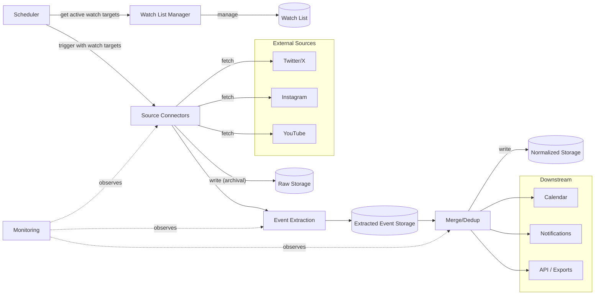

# Oshikatsu Architecture

## Overview

Oshikatsu is a platform for tracking updates about favorite artists and converting them into a unified, analyzable data format. The system ingests data from multiple sources, extracts one event candidate per raw item, merges/deduplicates those candidates into normalized canonical events, and exports to downstream pipelines.

> **Scope of this document.** ARCHITECTURE.md is a high-level, conceptual view of the platform. It describes how components are intended to relate and what shape data conceptually takes. It deliberately does **not** track implementation status, phase progress, or which fields are persisted today — that information lives in the phase design docs under `design_docs/`, in `TECH_DEBTS.md`, and (for the actual DB layout) in `src/db/schema.ts`. For the technology choices see [TECH_STACK.md](./TECH_STACK.md).



## Core Components

### 1. Source Connectors

Ingest raw items from external sources (e.g., Twitter/X, Instagram, YouTube).

- Each source has its own connector implementation
- Connectors expose `fetchUpdates()` to retrieve new items
- Connectors are source-agnostic and can be extended independently

### 2. Watch List Manager

Owns the **monitoring orchestration** layer: which artists from the Artist Database are actively being watched, and through which watch targets.

- Provides CRUD operations for watch targets and the enable/disable toggles that gate them
- Supports enable/disable toggles per artist (a master switch over all of an artist's watch targets) and per individual watch target
- Decouples "what to watch" from "how to fetch" — and from "who the artist is," which lives in the Artist Database

### 3. Event Extraction Engine

Converts raw source items into extracted event candidates using LLM-based parsing.

- Receives raw items directly from source connectors (not from storage)
- Exposes `extract(raw)` to transform one raw item into one extracted event candidate
- Uses LLM to parse unstructured text and extract structured event fields
- Each source may have its own prompt/parsing strategy
- Output follows the extracted event schema and preserves source provenance
- An extracted event is not yet canonical. It may duplicate or partially overlap with other extracted events.

### 4. Merge/Deduplication Layer

Identifies and merges duplicate or overlapping events across sources.

- Goal: consolidate multiple extracted events referring to the same real-world event into a single normalized record while preserving all provenance
- **Execution**: Runs synchronously as the final step of the ingestion pipeline.
- **Deduplication Strategy**: Queries extracted event storage for candidates within a specific time constraint (e.g., +/- 48 hours of `start_time`), then uses conservative signals such as exact source references, related link overlap, canonical venue ID, and title similarity to identify overlaps.
- **Auditability**: Merge decisions should be recorded with matched signals and a human-readable reason so false positives can be inspected.

### 5. Downstream Integration

Exposes standardized records to automation workflows.

- Exposes `export(record)` to push data to downstream pipelines
- Supports calendar updates, notification dispatch, and other integrations

### 6. Scheduler

Runs ingestion cycles periodically and manages execution state.

- Configurable interval (e.g., every 15 minutes)
- Reads active watch targets from the Watch List Manager and dispatches them to the appropriate connectors
- Idempotent: re-running does not create duplicates
- Graceful shutdown support
- Tracks execution state (last run, next run, errors, and pagination cursors)
- Implements rate limiting and exponential backoff to handle platform API limits.

### 7. Monitoring

Detects failures, tracks health metrics, and sends alerts.

- **Parser failure detection**: detects when selectors break or DOM changes cause fetch failures
- **Health checks**: validates output quality (items fetched, required fields present)
- **Alert thresholds**: zero items fetched, high error rate, stale data
- **Selector health tracking**: tracks selector match counts over time for trend analysis
- **Automated detection**: detects anti-bot pages, login prompts, CAPTCHAs
- **Health check command**: `healthcheck` command for external monitoring
- **Alert delivery**: email, webhook, or log-based alerts

### 8. Storage

Handles persistence of data across the pipeline. The names below describe logical storage roles; the physical layout may consolidate or split them.

- **Watch List**: Persists which artists are actively monitored, the watch targets that describe how each artist is monitored, and the per-artist and per-target enable/disable toggles. References artist identities from the Artist Database rather than holding them.
- **Raw Storage**: Persists raw payloads fetched from sources before normalization, along with metadata (source identifier, fetch timestamps, processing status).
- **Artist Database**: Owns the canonical artist identity — display name, categories, groups, known handles and channels. Consumed by the Watch List (to identify which artist a watch target belongs to), by Extraction (to link extracted events to known artists), and by downstream consumers for display and enrichment.
- **Venue Database**: Reference database of physical and virtual venue information and aliases. Extracted events may reference a canonical venue through `venue_id`, which is used as a conservative signal during merge/deduplication.
- **Extracted Event Storage**: Persists one extracted event candidate per raw item, plus extracted related links and source provenance.
- **Normalized Storage**: Persists canonical event records after deduplication/merging. These are the records downstream consumers should treat as the event timeline.

## Data Model

### Event Layer Terminology

- **Raw item**: Source payload fetched from a connector.
- **Extracted event**: One event candidate extracted from one raw item. This is source-derived and not deduplicated.
- **Normalized event**: Canonical event after merge/deduplication. A normalized event may aggregate multiple extracted events and their source provenance.

### Normalized Event Schema

> **Conceptual schema, not the DB schema.** The shape below describes how the platform reasons about an event end-to-end — the fields downstream consumers should be able to ask for. The physical storage representation may flatten nested objects, split fields across multiple tables, or add fields used only for bookkeeping. The source of truth for what is actually persisted is `src/db/schema.ts`.

```json
{
  "id": "internal record identifier",
  "source_references": [
    {
      "raw_item_id": "internal reference to the Raw Storage item",
      "source_id": "original ID from the source",
      "source_name": "source identifier (e.g., 'twitter')",
      "publish_time": "when the source item was published",
      "url": "link to the original source item",
      "author": "who posted it (user ID, username)",
      "venue_name": "venue text extracted from this source item, if present",
      "venue_url": "venue URL extracted from this source item, if present",
      "raw_content": "original text/content",
      "fetch_time": "when the item was ingested"
    }
  ],
  "related_links": [
    {
      "url": "URL mentioned by the source content or extracted as an event-relevant destination",
      "title": "human-readable title for the link"
    }
  ],
  "title": "canonical event title or event summary",
  "description": "normalized content summary",
  "start_time": "event start time",
  "end_time": "event end time",
  "venue": {
    "id": "canonical venue identifier when resolved (optional)",
    "name": "venue name (e.g., 'Tokyo Dome', 'Twitch')",
    "address": "physical address (for in-person events)",
    "coordinates": "latitude/longitude (optional)",
    "url": "platform/stream URL (for virtual events)",
    "city": "geographic context",
    "country": "geographic context"
  },
  "type": "event category",
  "is_cancelled": "boolean flag for cancelled events",
  "artist": {
    "id": "unique artist identifier",
    "name": "display name",
    "handle": "social media handle (e.g., Twitter/X username)",
    "profile_url": "link to artist profile",
    "categories": "artist type (e.g., singer, Vtuber, idol, voice actor)",
    "groups": "associated groups or units (if applicable)"
  },
  "tags": "normalized labels for event type, platform, fandom, or priority"
}
```

`source_references` and `related_links` serve different purposes:

- `source_references` preserve provenance: where the announcement came from.
- `related_links` describe destinations relevant to the event itself. Each related link stores only its URL and title.

### Event Categories

- `live_stream` — live stream event
- `merchandise` — merchandise release/news
- `release` — song/album/content release
- `concert` — concert or live show
- `broadcast` — TV/radio program update
- `collaboration` — partnership or co-branded project
- `side_event` — ancillary activity (merch booth, pre-show session, etc.)

### Event Hierarchy

- **Main events**: May have `sub_events` array
- **Sub-events**: Must have `parent_event_id`, cannot have their own `sub_events`
- Main events represent the core activity (e.g., the concert)
- Sub-events are related activity records linked back to the main event

## Interfaces

All components expose stable, abstract interfaces:

- `fetchUpdates()` — retrieve new items from a source
- `extract(raw)` — convert one raw source item into one extracted event candidate
- `merge(extracted)` — identify and merge duplicate/overlapping extracted events into canonical normalized events
- `save(record)` — persist extracted or normalized records depending on component boundary
- `export(record)` — expose records to downstream pipelines

## User Interface

The platform provides both a **TUI (Terminal UI)** and a **Web UI** for management and monitoring.

### Watch List Management

- Add, edit, remove artists and their watch targets
- Toggle monitoring per artist or per individual watch target
- View active vs. disabled watch targets at a glance

### Artist & Venue Management

- Browse and edit the Artist Database (profiles, known sources, categories, groups)
- Browse and edit the Venue Database (names, addresses, coordinates)
- Link new watch targets to existing artists

### Event Dashboard

- View normalized canonical events in a timeline or list view
- Filter by artist, event type, date range, or source
- Drill down into event details including source provenance

### Calendar View

- Visualize events on a calendar (monthly/weekly/daily)
- Color-coded by event type or artist
- Export to external calendar formats (iCal, Google Calendar)

### Ingestion Monitor

- View recent fetch cycles and their status (success, errors, items fetched)
- Inspect raw items and their processing status
- Surface alerts (anti-bot detection, selector failures, stale data)

## Design Principles

- **Modularity**: Clean separation between ingestion, extraction, deduplication/normalization, storage, and downstream export
- **Source-agnostic**: Design allows adding new sources with minimal impact
- **Provenance preservation**: Preserve source provenance while normalizing records
- **Incremental growth**: Start with a single source (Twitter/X) and expand to additional sources over time

## Success Criteria

- **Coverage**: Able to ingest new items from supported sources reliably
- **Consistency**: Raw data is extracted into a stable extracted schema, then merged into canonical normalized events
- **Extensibility**: New sources can be added with minimal disruption

## Long-term Direction

- Evolve from single-source ingestion into a platform supporting multiple types of information feeds
- Keep the focus on reusable data models and source-agnostic processing
- Support downstream use cases such as event tracking, content aggregation, automatic calendar creation, and automated notification dispatch
