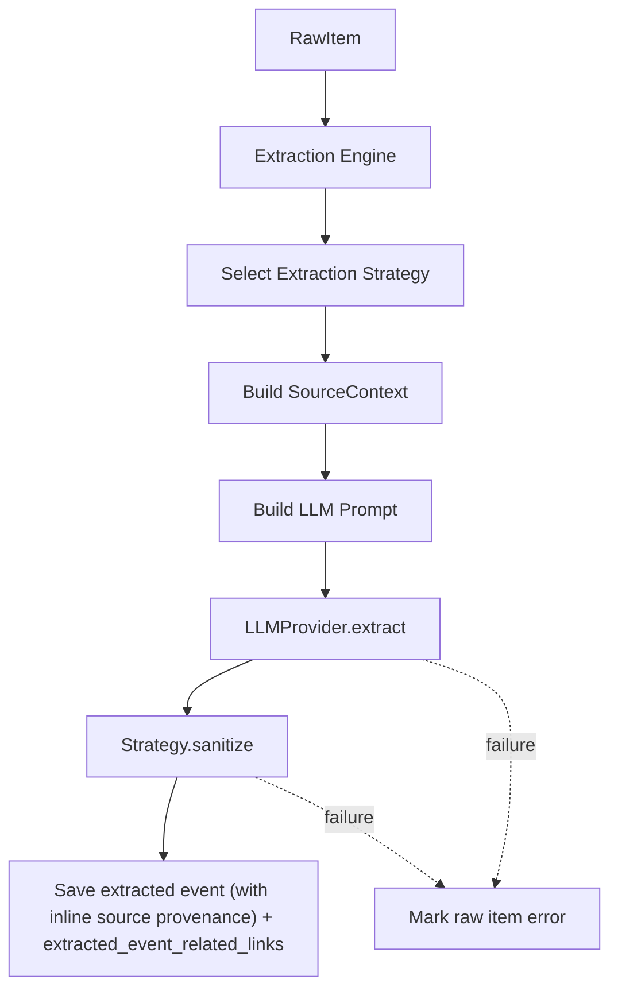

# Extraction Strategy Design

## Overview

The extraction strategy layer keeps the Phase 2 extraction engine source-agnostic by moving source-specific extraction, prompt construction, provenance mapping, and sanitization into strategy classes.

This design extends the Phase 2 extraction design in `design_docs/2026-04-24-phase2-designs/extraction.md`.

## Problem

The extraction pipeline needs different handling for each source. Twitter/X raw data, YouTube video data, Instagram posts, and future sources will all expose different shapes for:

- Main text content
- Publish time
- Author identity
- Canonical source URL
- Embedded links
- Media metadata
- Source-specific context useful for LLM parsing

If this logic lives directly in the engine, the engine becomes a collection of source-specific branches and hard-coded rules. That makes the pipeline harder to test, harder to extend, and more likely to regress when adding new sources.

## Goals

- Keep the engine responsible for orchestration only.
- Encapsulate source-specific raw data interpretation behind a stable interface.
- Support new source extractors without changing the engine.
- Preserve source provenance consistently as inline columns on the extracted event (`publish_time`, `author`, `source_url`, `raw_content`), including venue text extracted from that source item.
- Extract event-relevant links separately from source provenance.
- Mark raw items as `error` when LLM extraction, validation, or sanitization fails.
- Avoid hard-coded artist, venue, campaign, or event keyword rules in the core engine.

## Non-Goals

- This layer does not implement merge/deduplication.
- This layer does not decide whether two events are the same.
- This layer does not replace the LLM extraction step.
- This layer does not provide source connectors; connectors still only fetch raw data.
- This layer does not encode fan-domain-specific rules such as particular artists, groups, venues, or campaigns.

## Architecture



## Core Concepts

### Extraction Engine

The engine owns the workflow:

1. Load unprocessed raw items.
2. Select a strategy based on `source_name`.
3. Ask the strategy to build a normalized source context.
4. Ask the LLM provider to extract structured event fields.
5. Ask the strategy to sanitize the LLM result.
6. Persist the extracted event and source reference in one transaction. The extracted event stores `raw_item_id` directly; the source reference stores source provenance details for audit/debugging.
7. Mark the raw item as processed.
8. If context assembly, LLM extraction, schema validation, sanitization, or persistence fails, mark the raw item as `error`.

The engine must not contain source-specific parsing logic.

### SourceContext

`SourceContext` is the normalized view of a source item before event extraction.

```typescript
export interface SourceContext {
  text: string;
  publishTime: Date;
  author: string;
  url: string;
  relatedLinkCandidates: RelatedLinkCandidate[];
  rawContent: string;
}

export interface RelatedLinkCandidate {
  url: string;
  title?: string;
}
```

Field meanings:

- `text`: Primary text for extraction.
- `publishTime`: Source item publish time.
- `author`: Source author, username, channel, or account identifier.
- `url`: Canonical URL to the source item.
- `relatedLinkCandidates`: URLs mentioned inside the source item or exposed by source metadata.
- `rawContent`: Full context string passed to the LLM and stored as provenance.

The `url` field is provenance. `relatedLinkCandidates` are possible event destinations. Related links should store only URL and title.

Extracted venue fields are stored as `venue_name` and `venue_url` directly on the extracted event. Because each extracted event has exactly one source, the per-source extraction *is* the best display value. `venue_id` may point to a canonical venue when resolved.

### Extraction Strategy

Each strategy implements the source-specific behavior needed by the engine.

```typescript
export interface ExtractionStrategy {
  supports(sourceName: string): boolean;
  buildContext(rawItem: RawItem): SourceContext | null;
  buildPrompt(context: SourceContext): string;
  sanitize(rawItem: RawItem, context: SourceContext, extracted: EventExtractionResult): EventExtractionResult;
}
```

Method responsibilities:

- `supports`: Declares whether this strategy handles a source.
- `buildContext`: Converts raw source payloads into `SourceContext`.
- `buildPrompt`: Creates source-aware extraction instructions for the LLM.
- `sanitize`: Cleans valid LLM output and throws when required fields are empty or invalid.

## Built-In Strategies

### DefaultExtractionStrategy

The default strategy provides generic context and prompt behavior for unknown sources.

Behavior:

- Uses serialized raw JSON as the source text.
- Uses the current time if no publish time is available.
- Uses `unknown` as the author.
- Does not infer event type from keywords.
- Does not infer venue, artist, or campaign.

### TwitterExtractionStrategy

The Twitter/X strategy handles raw tweet payloads produced by the Twitter connector.

Behavior:

- Extracts tweet text from `rawData.legacy.full_text`.
- Extracts publish time from `rawData.legacy.created_at`.
- Extracts author from `rawData.core.user_results.result.legacy.screen_name`.
- Builds a canonical X status URL from author and tweet ID.
- Preserves the full tweet text in `rawContent`. The source publish time stays in `publishTime` and is persisted as `extracted_events.publish_time`; it is not included in the LLM text so it is not mistaken for an event start time.
- Reuses default prompt and sanitize behavior unless source-specific improvements are needed later.

The Twitter strategy should not contain artist-specific or campaign-specific business rules.

## Event Schema

Strategies share the same event extraction schema:

```typescript
export const EventExtractionSchema = z.object({
  title: z.string().min(1),
  description: z.string().min(1),
  start_time: z.string().optional(),
  end_time: z.string().optional(),
  venue_name: z.string().optional(),
  venue_url: z.string().optional(),
  related_links: z.array(z.object({
    url: z.string(),
    title: z.string().optional(),
  })).default([]),
  type: z.enum([
    "live_stream",
    "merchandise",
    "release",
    "concert",
    "broadcast",
    "collaboration",
    "side_event",
  ]),
  event_scope: z.enum(["main", "sub", "unknown"]).default("unknown"),
  parent_event_hint: z.string().optional(),
  tags: z.array(z.string()).default([]),
});
```

The fixed event type enum is part of the extracted event schema contract. It is not considered hard-coded inference behavior. General announcements are not an event type, but informational posts can still announce real events. Classification should follow the underlying activity being announced, updated, scheduled, cancelled, or linked: for example, a post announcing a scheduled concert is `concert`, and a post announcing a merch sale is `merchandise`.

`start_time` is optional. A source may announce a real sub-event, such as a merch sale, ticket lottery, booth, meet-and-greet, or pre-show, without restating the main event's time or even the sub-event's own time. The extractor should leave `start_time` unset when the source does not provide a safe activity time. The source publish time must not be used as `start_time`.

`event_scope` records whether the extracted activity is a standalone/main event, a sub-event tied to a larger event, or unclear. `parent_event_hint` is a best-effort text hint only; it should be set for sub-events only when the source names or clearly implies the larger event. The LLM may infer that a post is a sub-event from wording such as booth, goods, lottery, meet-and-greet, after-party, or same-day campaign, but it must not invent a main-event title as fact.

## Related Link Handling

Strategies are responsible for extracting explicit link candidates from raw source payloads. For Twitter/X, this includes expanded URLs from `rawData.legacy.entities.urls`.

The LLM may produce human-readable titles for candidate links when the surrounding text makes the purpose clear.

If title extraction fails, explicit candidate URLs should still be preserved with an empty or source-provided title. Strategies should deduplicate links by normalized URL before persistence.

Related links are saved as event content, not as provenance. The original source item URL is persisted inline as `extracted_events.source_url`.

## Language Policy

Extraction may summarize explanatory prose in English, but it must preserve official names and titles in their original written form.

Do not translate, romanize, or rewrite:

- Artist names
- Group names
- Concert titles
- Song titles
- Album titles
- Venue names
- Campaign names
- Hashtags
- Quoted official titles

For example, if the source text says `花譜` or `宿声`, the normalized title and description should keep those strings rather than changing them to a translation or romanization.

## Failure Policy

The engine does not create fallback extracted events. If the LLM call fails, returns malformed JSON, fails schema validation, or produces values that fail strategy sanitization, the raw item is marked as `error` and no extracted event or `extracted_event_related_links` rows are created for that attempt.

Allowed deterministic sanitization:

- Trim required strings and reject them if empty.
- Parse `start_time` and `end_time` when present, rejecting invalid timestamps.
- Preserve `event_scope`; store `parent_event_hint` only for sub-events.
- Preserve explicit related link candidates with URL and title only when the LLM extraction succeeds.
- Deduplicate related links by normalized URL.

Disallowed fallback behavior:

- Creating a minimal general-announcement record after LLM failure.
- Inferring event type from keywords after LLM failure.
- Inferring venue from keywords after LLM failure.
- Inferring artist, group, campaign, or location names from hard-coded lists.
- Adding special handling for a specific artist or fandom in the engine.

## Adding a New Source Strategy

To add a new source, for example YouTube:

1. Implement `YouTubeExtractionStrategy`.
2. Return `true` from `supports("youtube")`.
3. Convert YouTube raw payloads into `SourceContext`.
4. Add the strategy to `createDefaultExtractionStrategies()`.
5. Add focused tests or fixtures for representative raw items.

The `ExtractionEngine` should not need changes.

## Error Handling

- If `buildContext` returns `null`, the raw item is marked as `error`.
- If LLM extraction, validation, or sanitization fails, the raw item is marked as `error`.
- If persistence fails, the raw item is marked as `error`.
- If a raw item already has an extracted event, the engine marks it as processed and does not create a duplicate.

## Testing Strategy

Recommended tests:

- Strategy context extraction from representative raw Twitter payloads.
- Related link candidate extraction from representative raw Twitter payloads.
- Raw item is marked `error` when the LLM provider throws.
- Raw item is marked `error` when the LLM provider returns invalid timestamps or empty required fields.
- Engine idempotency when a raw item already has an extracted event.
- Persistence verifies matching extracted event row (with inline source provenance fields populated) and `extracted_event_related_links` counts.

## Current Implementation Status

Implemented files:

- `src/core/ExtractionStrategy.ts`
- `src/core/ExtractionEngine.ts`
- `src/db/schema.ts`
- `src/tui/views/Events.tsx`

Current built-in strategies:

- `DefaultExtractionStrategy`
- `TwitterExtractionStrategy`

The engine has been refactored to use strategies and no longer contains source-specific fallback keyword rules or LLM-failure fallback event creation.

Related link extraction and persistence are implemented with `extracted_event_related_links`. Related links store only `url` and optional `title`.
