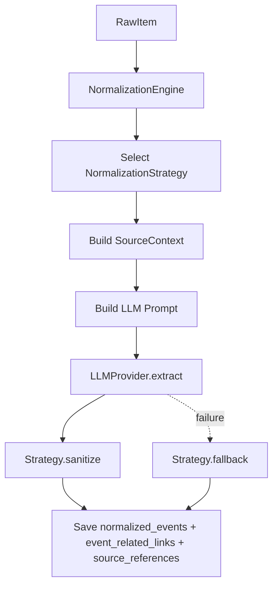

# Normalization Strategy Design

## Overview

The Normalization Strategy layer keeps the `NormalizationEngine` source-agnostic by moving source-specific extraction, prompt construction, provenance mapping, and fallback behavior into strategy classes.

This design extends the Phase 2 normalization design in `design_docs/2026-04-24-phase2-designs/normalization.md`.

## Problem

The normalization pipeline needs different handling for each source. Twitter/X raw data, YouTube video data, Instagram posts, and future sources will all expose different shapes for:

- Main text content
- Publish time
- Author identity
- Canonical source URL
- Embedded links
- Media metadata
- Source-specific context useful for LLM parsing

If this logic lives directly in `NormalizationEngine`, the engine becomes a collection of source-specific branches and hard-coded rules. That makes the pipeline harder to test, harder to extend, and more likely to regress when adding new sources.

## Goals

- Keep `NormalizationEngine` responsible for orchestration only.
- Encapsulate source-specific raw data interpretation behind a stable interface.
- Support new source normalizers without changing the engine.
- Preserve source provenance consistently in `source_references`, including venue text extracted from that source item.
- Extract event-relevant links separately from source provenance.
- Keep fallback behavior conservative and generic when LLM extraction fails.
- Avoid hard-coded artist, venue, campaign, or event keyword rules in the core engine.

## Non-Goals

- This layer does not implement merge/deduplication.
- This layer does not decide whether two events are the same.
- This layer does not replace the LLM extraction step.
- This layer does not provide source connectors; connectors still only fetch raw data.
- This layer does not encode fan-domain-specific rules such as particular artists, groups, venues, or campaigns.

## Architecture



## Core Concepts

### NormalizationEngine

The engine owns the workflow:

1. Load unprocessed raw items.
2. Select a strategy based on `source_name`.
3. Ask the strategy to build a normalized source context.
4. Ask the LLM provider to extract structured event fields.
5. Ask the strategy to sanitize the LLM result.
6. If LLM extraction fails, ask the strategy for a conservative fallback event.
7. Persist the normalized event and source reference in one transaction.
8. Mark the raw item as processed or error.

The engine must not contain source-specific parsing logic.

### SourceContext

`SourceContext` is the normalized view of a source item before event extraction.

```typescript
export interface SourceContext {
  text: string;
  publishTime: Date;
  author: string;
  url: string;
  relatedLinkCandidates: RelatedLinkCandidate[];
  rawContent: string;
}

export interface RelatedLinkCandidate {
  url: string;
  title?: string;
}
```

Field meanings:

- `text`: Primary text for extraction.
- `publishTime`: Source item publish time.
- `author`: Source author, username, channel, or account identifier.
- `url`: Canonical URL to the source item.
- `relatedLinkCandidates`: URLs mentioned inside the source item or exposed by source metadata.
- `rawContent`: Full context string passed to the LLM and stored as provenance.

The `url` field is provenance. `relatedLinkCandidates` are possible event destinations. Related links should store only URL and title.

Extracted venue fields belong in `source_references` as source-specific provenance. Event-level venue fields may hold the best display value, and `venue_id` may point to a canonical venue when resolved.

### NormalizationStrategy

Each strategy implements the source-specific behavior needed by the engine.

```typescript
export interface NormalizationStrategy {
  supports(sourceName: string): boolean;
  buildContext(rawItem: RawItem): SourceContext | null;
  buildPrompt(context: SourceContext): string;
  sanitize(rawItem: RawItem, context: SourceContext, extracted: ExtractedEvent): ExtractedEvent;
  fallback(rawItem: RawItem, context: SourceContext): ExtractedEvent;
}
```

Method responsibilities:

- `supports`: Declares whether this strategy handles a source.
- `buildContext`: Converts raw source payloads into `SourceContext`.
- `buildPrompt`: Creates source-aware extraction instructions for the LLM.
- `sanitize`: Cleans valid LLM output and fills missing safe defaults.
- `fallback`: Creates a minimal event if LLM extraction fails.

## Built-In Strategies

### DefaultNormalizationStrategy

The default strategy is a conservative fallback for unknown sources.

Behavior:

- Uses serialized raw JSON as the source text.
- Uses the current time if no publish time is available.
- Uses `unknown` as the author.
- Produces a generic `announcement` fallback.
- Extracts hashtags only as generic tags.
- Does not infer event type from keywords.
- Does not infer venue, artist, or campaign.

### TwitterNormalizationStrategy

The Twitter/X strategy handles raw tweet payloads produced by the Twitter connector.

Behavior:

- Extracts tweet text from `rawData.legacy.full_text`.
- Extracts publish time from `rawData.legacy.created_at`.
- Extracts author from `rawData.core.user_results.result.legacy.screen_name`.
- Builds a canonical X status URL from author and tweet ID.
- Preserves the post timestamp and full tweet text in `rawContent`.
- Reuses default prompt, sanitize, and fallback behavior unless source-specific improvements are needed later.

The Twitter strategy should not contain artist-specific or campaign-specific business rules.

## Event Schema

Strategies share the same event extraction schema:

```typescript
export const EventExtractionSchema = z.object({
  title: z.string().min(1),
  description: z.string().min(1),
  event_time: z.string(),
  venue_name: z.string().optional(),
  venue_url: z.string().optional(),
  related_links: z.array(z.object({
    url: z.string(),
    title: z.string().optional(),
  })).default([]),
  type: z.enum([
    "live_stream",
    "merchandise",
    "release",
    "concert",
    "broadcast",
    "collaboration",
    "side_event",
    "announcement",
  ]),
  tags: z.array(z.string()).default([]),
});
```

The fixed event type enum is part of the unified event schema contract. It is not considered hard-coded inference behavior.

## Related Link Handling

Strategies are responsible for extracting explicit link candidates from raw source payloads. For Twitter/X, this includes expanded URLs from `rawData.legacy.entities.urls`.

The LLM may produce human-readable titles for candidate links when the surrounding text makes the purpose clear.

If title extraction fails, explicit candidate URLs should still be preserved with an empty or source-provided title. Strategies should deduplicate links by normalized URL before persistence.

Related links are saved as event content, not as provenance. The original source item URL remains in `source_references.url`.

## Language Policy

Normalization may summarize explanatory prose in English, but it must preserve official names and titles in their original written form.

Do not translate, romanize, or rewrite:

- Artist names
- Group names
- Concert titles
- Song titles
- Album titles
- Venue names
- Campaign names
- Hashtags
- Quoted official titles

For example, if the source text says `花譜` or `宿声`, the normalized title and description should keep those strings rather than changing them to a translation or romanization.

## Fallback Policy

Fallback events are intentionally conservative.

Allowed fallback behavior:

- Create a minimal `announcement` record.
- Use the first non-empty line as the title.
- Use the source text as the description.
- Use source publish time as `event_time`.
- Preserve source URL, author, and raw content in `source_references`.
- Preserve explicit related link candidates with URL and title only.
- Extract explicit hashtags as tags.

Disallowed fallback behavior:

- Inferring event type from keywords.
- Inferring venue from keywords.
- Inferring artist, group, campaign, or location names from hard-coded lists.
- Adding special handling for a specific artist or fandom in the engine.

More sophisticated inference should come from the LLM, a configurable rules layer, or a later reviewed design.

## Adding a New Source Strategy

To add a new source, for example YouTube:

1. Implement `YouTubeNormalizationStrategy`.
2. Return `true` from `supports("youtube")`.
3. Convert YouTube raw payloads into `SourceContext`.
4. Add the strategy to `createDefaultNormalizationStrategies()`.
5. Add focused tests or fixtures for representative raw items.

The `NormalizationEngine` should not need changes.

## Error Handling

- If `buildContext` returns `null`, the raw item is marked as `error`.
- If LLM extraction fails, the strategy fallback is used.
- If persistence fails, the raw item is marked as `error`.
- If a raw item already has a `source_references` row, the engine marks it as processed and does not create duplicate normalized events.

## Testing Strategy

Recommended tests:

- Strategy context extraction from representative raw Twitter payloads.
- Related link candidate extraction from representative raw Twitter payloads.
- Related link preservation when the LLM provider throws.
- Default strategy fallback for unknown raw items.
- Engine idempotency when a raw item already has a source reference.
- Engine fallback path when the LLM provider throws.
- Persistence verifies matching `normalized_events`, `event_related_links`, and `source_references` counts.

## Current Implementation Status

Implemented files:

- `src/core/NormalizationStrategy.ts`
- `src/core/NormalizationEngine.ts`
- `src/db/schema.ts`
- `src/tui/views/Events.tsx`

Current built-in strategies:

- `DefaultNormalizationStrategy`
- `TwitterNormalizationStrategy`

The engine has been refactored to use strategies and no longer contains source-specific fallback keyword rules.

Related link extraction and persistence are implemented with `event_related_links`. Related links store only `url` and optional `title`.
