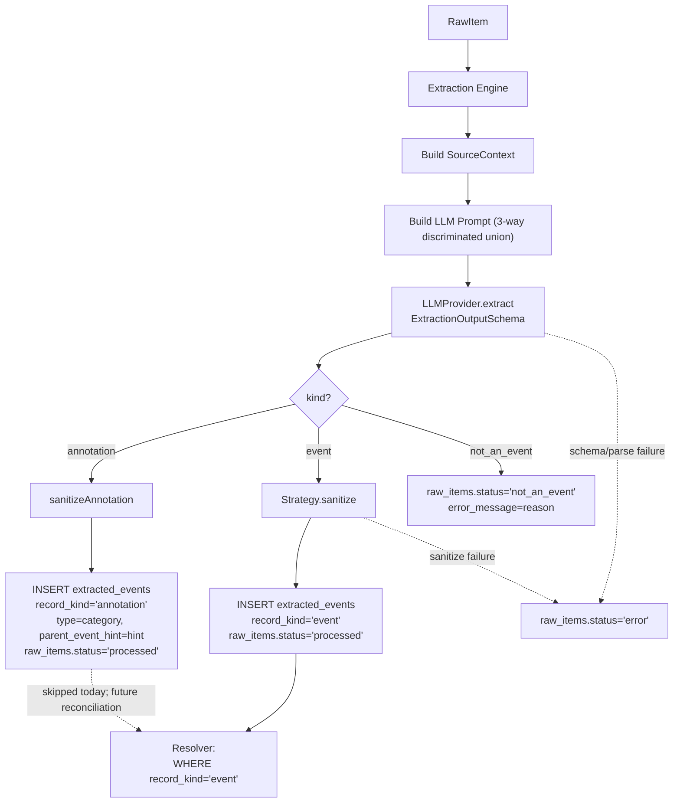

# Non-Event Classification

> **Status:** Landed.
> **Follow-ups:** Reconciliation that fuzzy-matches annotation rows' `parent_event_hint` against `normalized_events.title` so milestones, press coverage, recaps, and reminder reposts can be displayed under their parent event in the web UI; plus an operator surface for inspecting/retrying `not_an_event` rows. Both tracked in `TECH_DEBTS.md`.

## Overview

The extraction pipeline previously treated every raw item as an event candidate. Posts that are not events were either force-fit into the event taxonomy by the LLM or fell through `EventExtractionSchema` validation and ended up in `raw_items.status = 'error'`, indistinguishable from real failures.

This design splits non-events into two destinations along a different axis — *does the post relate to an existing event, or not?*

- **Annotations** (related to an existing event): land in `extracted_events` with `record_kind='annotation'`. They share the same 1:1 raw-item relationship and the same provenance shape as events, and reuse `parent_event_hint` for the linkage. The resolver and read-layer queries filter to `record_kind='event'` on the event-normalization path; annotations sit in the table waiting for a future reconciliation step to attach them to their parent normalized event.
- **Orphan posts** (not related to any event): land in `raw_items.status = 'not_an_event'`. Terminal at the raw-item layer; no `extracted_events` row.

This design extends `design_docs/2026-04-25-extraction-strategy/extraction-strategy.md`.

## Problem

Several classes of fan-account post are structurally not events but look event-adjacent:

- **Milestones**: counts, rankings, threshold updates, chart positions, playlist additions for an already-existing release/concert.
- **Press coverage**: third-party coverage of an existing activity.
- **Recaps**: backward-looking thanks or reports about a completed activity.
- **Reminder reposts**: restate an already-announced activity without new information.
- **Mood**: greetings, personal thoughts, weather, well-wishes.
- **Fan engagement**: shoutouts, retweets of fan content, replies that do not announce a new activity.
- **Other**: not an event but does not fit the above.

Force-fitting any of these into the event taxonomy creates duplicate or misleading rows. The previous filter — instructing the LLM to "return an empty JSON object so validation fails" — landed everything in `status = 'error'`, mixing genuine LLM/parse failures with deliberate non-event classifications.

The first four classes share an important property: they reference a specific existing event. That signal is worth capturing structurally so a future UI can display milestones and coverage under their parent event, instead of dropping the signal on the floor or creating duplicate event rows. The last three classes do not reference any event and are pure orphan posts.

## Goals

- Make non-event classification an explicit branch of the extraction output, not an implicit validation failure.
- For non-events that reference an existing event, capture the linkage in a shape the resolver can consume *without crossing the layer boundary back into `raw_items`*. The resolver's input contract is the `extracted_*` tables.
- For orphan posts that don't reference any event, terminate cleanly at the raw-item layer.
- Keep `status = 'error'` reserved for real failures so the Monitor failure panel stays meaningful.
- Avoid artist-specific or campaign-specific examples in the LLM prompt to prevent overfitting.
- No new tables. Annotations fit the existing `extracted_events` shape; a discriminator column distinguishes them.

## Non-Goals

- A reconciliation step that resolves annotations against existing events. Today annotations sit in `extracted_events` with `parent_event_hint` set, and the resolver's `processBatch` filters them out via `record_kind='event'`. Building the matcher and a UI surface to display attached annotations is deferred until there's a real consumer.
- A separate `extracted_event_annotations` (or similar) table. Folding into `extracted_events` keeps one table, one repo, one provenance shape, and reuses the existing `parent_event_hint` field.
- Per-category retry or re-classification UI. Operators can use `npm run reset:raw` if a misclassification needs to be retried.

## Architecture



## Schema

### `extracted_events.record_kind`

A new TEXT column with enum `'event' | 'annotation'`, default `'event'`.

```sql
ALTER TABLE extracted_events ADD record_kind TEXT NOT NULL DEFAULT 'event';
CREATE INDEX idx_extracted_events_record_kind ON extracted_events(record_kind);
```

Existing rows backfill as `'event'`, which is correct.

For annotation rows:

- `type` carries the annotation category (`milestone | press_coverage | recap | reminder_repost`) instead of an event type. The `record_kind` discriminator tells callers which enum to interpret it as. This avoids adding a parallel `annotation_category` column.
- `parent_event_hint` carries the free-form name of the existing event being referenced. For events this field is set only for sub-events; for annotations it is required (the whole point of the branch).
- `start_time`, `end_time`, `venue_id`, `venue_name`, `venue_url` are null. Annotations don't have their own time or venue; they inherit semantics from the parent event.
- `event_scope` is left as `'unknown'` for annotations — the field is meaningful only for events.

### `raw_items.status`

The `status` column accepts four values:

- `new`: queued for extraction.
- `processed`: extraction succeeded — produced either an event row or an annotation row in `extracted_events`.
- `error`: extraction failed (LLM call, parse, schema validation, sanitize, or persistence). Surfaced in the Monitor failure panel.
- `not_an_event`: LLM classified the post as an orphan (mood, fan_engagement, other). Terminal; no `extracted_events` row.

The `not_an_event` reason text is stored in the existing `error_message` column so the RawItems detail panel renders it without extra plumbing. `error_class` is null for `not_an_event` rows. The orphan category (mood/fan_engagement/other) is *not* persisted as a column today — it appears only in the engine log line. A column can be added later if a consumer needs to filter by it; for now the YAGNI choice is to keep the row narrow.

Migration: `0023_extracted_events_record_kind.sql`. This supersedes the columns briefly added in `0022` (`not_an_event_category`, `related_event_hint`), which are dropped in 0023 — they had mixed structured event-resolution signal into the ingestion-side table, which is the boundary this design preserves.

## LLM Output

`ExtractionOutputSchema` is a discriminated union on a literal `kind` field, with three branches:

```typescript
ExtractionOutputSchema = z.discriminatedUnion("kind", [
  EventBranchSchema,        // kind="event"; existing event fields
  AnnotationBranchSchema,   // kind="annotation"; category + required parent_event_hint
  NotAnEventBranchSchema,   // kind="not_an_event"; orphan category + reason
]);
```

The annotation branch carries:

- `kind: "annotation"` literal
- `title`, `description` (so the row has displayable content)
- `category` from `ANNOTATION_CATEGORIES`
- `parent_event_hint` (required, non-empty)
- `related_links`, `tags` (same shape as events)

It deliberately does not carry `start_time`, `end_time`, `venue_*`, `type`, or `event_scope` — those are event-only concepts.

The orphan branch carries `kind: "not_an_event"`, `category` from `NON_EVENT_CATEGORIES`, and a free-form `reason`. It does not carry `parent_event_hint`; an orphan post by definition does not reference a specific event.

`EventExtractionSchema` is preserved as an alias for the event branch so existing call sites (sanitize, tests) continue to operate on the event shape only.

## Categories

### Annotation categories (`ANNOTATION_CATEGORIES`)

| Category          | When                                                                                         |
|-------------------|----------------------------------------------------------------------------------------------|
| `milestone`       | Count, ranking, threshold, chart position, playlist addition, or other measurement update for an existing activity. |
| `press_coverage`  | Third-party coverage (interview, feature, broadcast mention) of an existing activity.        |
| `recap`           | Backward-looking thanks, summary, or report about a completed activity.                      |
| `reminder_repost` | Restates an already-announced activity without new information.                              |

### Orphan categories (`NON_EVENT_CATEGORIES`)

| Category          | When                                                                                         |
|-------------------|----------------------------------------------------------------------------------------------|
| `mood`            | Greetings, personal thoughts, weather, well-wishes, posts not tied to a specific activity.   |
| `fan_engagement`  | Retweets of fan content, shoutouts, replies that do not announce a new activity.             |
| `other`           | Not an event, annotation, or any of the above.                                               |

The split between annotations and orphans tracks one question only: *can the LLM identify a specific existing event the post references?* If yes, it's an annotation regardless of the structural category. If no, it's an orphan.

## Prompt Policy

The prompt describes all three branches and both category sets using structural glosses only. It does not embed examples drawn from the current artist corpus. Concrete examples (specific tweet phrasings, particular hashtags, particular campaign titles) overfit the prompt to whichever accounts happen to be on the watch list at design time and bias the LLM toward those patterns at the expense of structurally-similar items from other artists.

The prompt also distinguishes "no event details available" from "not an event" from "annotation":

- A post that announces a real activity with sparse details → `kind="event"` with best-effort fields.
- A post that comments on or measures a specific existing event without announcing a new activity → `kind="annotation"` with `parent_event_hint`.
- A post that is neither, or that references no specific event the LLM can identify → `kind="not_an_event"`.

## Engine Flow

`ExtractionEngine.processItem` routes by the discriminator:

- `kind === "event"` → `strategy.sanitize`, `saveExtractedEvent` writes `extracted_events` with `record_kind='event'` and the existing event fields, plus `extracted_event_related_links`. Raw item marked `processed`. `processItem` returns `true`.
- `kind === "annotation"` → `sanitizeAnnotation`, `saveExtractedAnnotation` writes `extracted_events` with `record_kind='annotation'`, `type=category`, `parent_event_hint=hint`, and null `start_time/end_time/venue_*`. Plus `extracted_event_related_links` from the annotation. Raw item marked `processed`. `processItem` returns `true`.
- `kind === "not_an_event"` → `RawStorage.markNotAnEvent(itemId, category, reason)` writes `status='not_an_event'`, `error_message=reason`. The category is logged but not persisted. No `extracted_events` row. `processItem` returns `true` so the item counts as processed in the batch summary, not failed.
- Schema/parse/sanitize errors → `markError`, `processItem` returns `false`.

`sanitizeAnnotation` is a free function (not on the strategy interface). It validates `title`, `description`, and `parent_event_hint` are non-empty, normalizes tags, and merges related-link candidates from the source context. There's no source-specific divergence yet; if one appears we promote it to the strategy.

## Resolver Behavior

`EventResolver.processBatch` filters its candidate query to `record_kind='event'`:

```sql
WHERE record_kind = 'event'
  AND id NOT IN (SELECT candidate_extracted_event_id FROM event_resolution_decisions)
```

Annotation rows are simply skipped. They never produce an `event_resolution_decisions` row, never become a `normalized_event_sources` entry, and never feed the `export_queue`. This keeps the resolver's mental model unchanged: the canonical-event pipeline is event-only, and annotations are a parallel signal that future reconciliation can layer on top.

This filter is the single critical change in the consumer chain. Other readers — `ExportRunner`, `ReviewQueueQueries`, `NormalizedEventsQueries.getNormalizedEventDetail` — join `extracted_events` only via `normalized_event_sources` or `event_resolution_decisions`, both of which are populated only for event rows. They are naturally annotation-free and need no filter.

## Read Layer

`listExtractedEvents` (the query backing the TUI Events view and any web list) accepts an optional `recordKind: "event" | "annotation"` option, defaulting to `"event"`. Existing callers see only event rows. The annotation-aware UI when it lands can pass `"annotation"`.

## What This Replaces

The previous instruction in `DefaultExtractionStrategy.buildPrompt`:

> Do not use a generic "announcement" category. If the post does not announce, update, schedule, cancel, or link to a specific activity in one of the allowed event types, return an empty JSON object so validation fails.

is removed. The non-event paths are now explicit branches with their own schemas and persistence paths.

The earlier iteration of this design (briefly landed in migration 0022) added `not_an_event_category` and `related_event_hint` columns to `raw_items` to capture the same signal at the ingestion layer. Those columns are dropped in 0023. They mixed structured resolution signal into a table the resolver does not read; folding annotations into `extracted_events` solves the problem without crossing the layer boundary.

## Open Follow-Ups

- **Reconciliation of annotations against normalized events**: annotation rows sit in `extracted_events` with `parent_event_hint` set but never get attached to their parent in `normalized_events`. A future step can fuzzy-match the hint against `normalized_events.title` (scoped to artist) and write into a small `normalized_event_annotations` join (or extend `normalized_event_sources` with an annotation role). This is what enables the "milestones for this event" web UI.
- **Operator inspection surface**: there is no UI today for browsing `not_an_event` rows by category, spot-checking the LLM's classification, or returning misclassified items to the queue. The reset script is the only path.
- **Feed-rail filters**: `IDEAS.md` notes a planned content-type filter on the Phase 6 Feed rail. With this design, the filter has two natural axes: `extracted_events.record_kind` for the event-vs-annotation split, and `raw_items.status='not_an_event'` for the orphan firehose. If a filter needs the orphan category granularity, that's the moment to promote the category back into a `raw_items` column.
