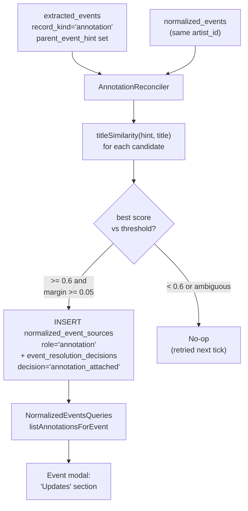

# Annotation Reconciliation

> **Status:** Landed.
> **Follow-ups:** Builds on `design_docs/2026-05-10-non-event-classification/non-event-classification.md`. Operator surface for `not_an_event` orphan rows is a separate piece, tracked in `TECH_DEBTS.md`. Open questions on artist linkage, annotation aging, and cross-tour ambiguity (see below) remain deferred.

## Overview

The non-event classification design lands annotation rows in `extracted_events` with `record_kind='annotation'` and a free-form `parent_event_hint`. Today those rows sit in the table and never get attached to any `normalized_events` row — the resolver explicitly filters them out via `WHERE record_kind='event'`. This design adds the reconciliation step that closes the loop: take an annotation, fuzzy-match its `parent_event_hint` against `normalized_events.title` (scoped to the same artist), and attach it to its parent event so the web UI can surface milestones / press coverage / recaps / reminder reposts under their parent event.

## Problem

Annotation rows are a structured signal sitting in the database with no consumer. The signal is rich — fan accounts repeatedly post counts, chart positions, press features, and recap threads about an existing concert, single, or fanmeeting — and folding it under the parent event in the UI is what makes the dashboard answer "what's happening with my oshi for this specific event" instead of just "what's announced next." Without reconciliation, the only place this signal surfaces is the raw Feed rail, where it sits alongside every other post regardless of which event it relates to.

The reconciliation problem itself is a smaller, easier cousin of the Phase 3 event-resolution problem. We are matching a free-form hint string against an existing canonical title for the same artist, not building a new canonical record or scoring multiple corroborating signals. The matching primitive (`titleSimilarity`) already exists.

## Goals

- Attach annotation rows to their parent `normalized_events` row when the LLM-supplied `parent_event_hint` matches an existing canonical title well enough.
- Make "annotations for this event" a queryable shape from the read layer so the web UI can render them.
- Reuse the existing `normalized_event_sources` join and `event_resolution_decisions` audit table rather than introducing parallel infrastructure.
- Run as its own scheduler task, independent of the event resolver. A reconciliation pass should not block event resolution and vice versa.
- Defer rather than guess on ambiguous matches. Annotations are not load-bearing; an unmatched milestone is fine, a wrongly-attached milestone is not.

## Non-Goals

- Reconciliation for orphan posts (`raw_items.status='not_an_event'`). Orphans by definition do not reference a specific event; there is nothing to reconcile against.
- An operator review queue for ambiguous annotations. Below-threshold rows simply remain unattached and the LLM gets retried on hint quality via re-extraction; we are not surfacing them for human disambiguation in v1.
- Per-annotation edit UI. The fan dashboard renders attached annotations read-only.
- Cross-artist matching. Annotations attach only to events under the same `artist_id` as the source raw item.
- Backfill of historical annotations using a smarter matcher later. The reconciler is idempotent (see below) and will re-attempt unattached rows on every pass; if matching improves, the existing rows benefit on the next tick without a one-shot backfill script.

## Architecture



## Schema

No new tables. Two minimal extensions to existing tables:

### `normalized_event_sources.role`

Today this column takes `'primary' | 'merged'`. Annotation reconciliation adds a third value: `'annotation'`.

```sql
-- No DDL change. The column is already TEXT NOT NULL.
-- Application code accepts 'primary' | 'merged' | 'annotation'.
```

The existing unique index `idx_normalized_event_sources_dedup (normalized_event_id, extracted_event_id)` still holds: an annotation extracted_event maps to at most one normalized event. This is the right invariant — the LLM's hint identifies one parent event, not a set.

### `event_resolution_decisions.decision`

Today this column takes `'merged' | 'new' | 'linked_as_sub' | 'needs_review' | 'no_match'` (event-resolver values). Reconciliation adds:

- `'annotation_attached'`: the reconciler found a parent above threshold with sufficient margin and wrote the join row.
- `'annotation_no_match'`: no candidate scored above threshold. Recorded only when the reconciler explicitly decides to stop retrying — see "Idempotency and retry" below.

The audit row carries `score` (the best similarity), `signals` (the candidate set and their scores), and `reason` (human-readable explanation). Same shape as event-resolver decisions.

### Why reuse, not a new table?

A parallel `normalized_event_annotations` table was considered. Rejected because:

- The join shape is identical to `normalized_event_sources` (a `(normalized_event_id, extracted_event_id)` pair). Duplicating the table duplicates the index, the FK chain, and the read joins for no semantic gain.
- The decision-audit shape is identical to `event_resolution_decisions`. Same argument.
- Reusing `role='annotation'` on the existing join keeps the contract "every link between an extracted record and a normalized event is one row in `normalized_event_sources`, regardless of kind."
- Cost of reuse: query callers that filter by role must remember to do so. This is a one-line `WHERE role = 'primary' OR role = 'merged'` change at three call sites (resolver read-back, export runner, normalized-event detail query). Worth it.

## Matching Algorithm

For each annotation row in `extracted_events`:

1. **Candidate set**: all `normalized_events` rows whose `artist_id` equals the annotation's source artist. Annotation source artist is derived from `raw_items.target_id` → `watch_list_targets.artist_id`, the same chain the event resolver uses. (See "Open Questions" on the small wrinkle here.)
2. **Score each candidate** with `titleSimilarity(annotation.parent_event_hint, candidate.title)`. The function is CJK-safe and already powers Phase 3 resolution.
3. **Pick the top score**. If it is `>= 0.6` (the project-wide auto-merge threshold from Phase 3) and the margin between the top two scores is `>= 0.05`, attach.
4. **Otherwise defer**. Do not write a decision row; the annotation will be re-evaluated on the next tick. See "Idempotency and retry."

Threshold and margin are deliberately reused from Phase 3 rather than newly tuned. Annotation matching is structurally easier than event resolution (no time/venue noise), so 0.6 is a floor we know is safe. Margin handles the case where a tour has multiple near-identically-titled stops ("Tour 2026 Day 1", "Tour 2026 Day 2") — if the hint is ambiguous between them, we want to defer rather than guess.

## Idempotency and Retry

The reconciler runs every tick over unattached annotation rows. "Unattached" means: `extracted_events.record_kind='annotation'` AND no row in `normalized_event_sources` with `role='annotation'` for this `extracted_event_id`.

There are two terminal states:

- **Attached**: a `normalized_event_sources` row exists. The reconciler skips this annotation forever.
- **Permanently no-match**: an `event_resolution_decisions` row with `decision='annotation_no_match'` exists. The reconciler skips this annotation too.

And one non-terminal state:

- **Deferred**: no source row, no decision row. The reconciler re-evaluates on every tick.

The reconciler writes `'annotation_no_match'` only when it has scanned the candidate set *and the set is non-empty* — i.e., the artist has at least one normalized event and none scored above threshold. If the candidate set is empty (a brand-new artist with no canonical events yet), the row stays deferred indefinitely. This is the common case at watch-list bootstrap and we want the reconciler to pick up the annotation as soon as the first matching event lands.

Trade-off: a low-quality hint against an artist with many normalized events will burn a `no_match` decision permanently, and future improvements to the matcher won't retry it without a manual reset. Mitigated by the threshold being conservative; if this becomes a real issue we add a small `reset:annotations` script (parallel to existing `reset:*` scripts).

## Engine

New module `src/core/AnnotationReconciler.ts`, sibling to `EventResolver.ts`:

- `AnnotationReconciler.processBatch({ batchSize, db })`: load up to `batchSize` deferred annotations, group by artist (so the candidate fetch is one query per artist instead of one per annotation), score, write decisions and source rows in a transaction per annotation.
- Returns `{ attached, deferred, noMatch, errors }` for scheduler-run accounting.

New `ScheduledTask` `"AnnotationReconciliation"` in `Scheduler.ts`, default cadence 5 minutes (same as event resolution). It runs after the event-resolution tick so newly created normalized events are visible to the reconciler immediately.

The reconciler does *not* touch `raw_items` or `extracted_events`. It only writes to `normalized_event_sources` and `event_resolution_decisions`. This preserves the layer boundary the non-event design established.

## Read Layer

New query in `src/core/queries/NormalizedEventsQueries.ts`:

```ts
listAnnotationsForEvent(normalizedEventId: string): AnnotationListItem[]
```

Returns the attached annotations for one event, joined with their source `extracted_events` row (for category and description) and `raw_items` row (for `posted_at`, `source_url`, author handle). Ordered by `raw_items.posted_at DESC`.

`AnnotationListItem` shape:

- `id` (extracted_event id)
- `category` (`milestone | press_coverage | recap | reminder_repost`, read from `extracted_events.type`)
- `title`, `description`
- `postedAt`, `sourceUrl`, `sourceAuthor`
- `relatedLinks` (from `extracted_event_related_links`)

`getNormalizedEventDetail` adds an `annotations: AnnotationListItem[]` field, populated via a single batched query rather than per-event N+1.

The existing `listExtractedEvents({ recordKind: "annotation" })` path stays available for admin/operator inspection of unattached rows.

## UI

Event modal grows an "Updates" section below the description, rendering attached annotations grouped by category badge:

- Milestones (chart positions, count thresholds)
- Press coverage
- Recaps
- Reminders

Each row: category chip, one-line snippet (title or first line of description), post time relative to now, link out to the source post. No interactivity beyond the link — the fan dashboard remains read-only.

If the event has zero attached annotations, the section is omitted entirely (no empty state). Most events will have zero, especially upcoming ones.

The Feed rail is unchanged. Annotations continue to appear there with their event-type badge from the non-event classification design; the Updates section is additive context inside the modal, not a replacement for the feed-level surfacing.

## Migration

`0024_normalized_event_sources_annotation_role.sql`: no schema change, but the migration file exists as a marker for the application-level value extension. Optionally adds:

```sql
CREATE INDEX idx_normalized_event_sources_role
  ON normalized_event_sources(role);
```

if the reconciler's "unattached annotations" query benefits from it (decide after measuring on real data).

## What This Enables

- Event modal "Updates" section (this design's primary consumer).
- Future "hype index" — count of attached milestones over time per event — listed in `IDEAS.md`.
- Future per-event activity feed sorted by post time, mixing attached annotations with the event row's own provenance.

## Open Questions

- **Artist linkage for annotations.** The annotation's artist is currently inferred via `raw_items.target_id → watch_list_targets.artist_id`. For watch-list targets that follow non-artist accounts (rare, but supported), this could be wrong. The non-event design did not address this; for the reconciler we accept the current heuristic and revisit if false-attachments appear.
- **Annotation aging.** A recap posted three months after the event is still a valid annotation. A "press coverage" post for an event that happened two years ago is probably noise. No time-window filter in v1; revisit if old-event annotations crowd the Updates section unhelpfully.
- **Cross-tour ambiguity.** "Tour 2026 Final" against "Tour 2026 Day 5" can score high on both. The 0.05 margin rule defers these. If deferrals stack up visibly, consider adding event start_time proximity as a tiebreaker signal.
